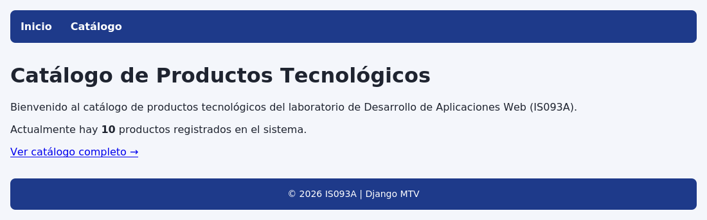

Integrantes

Coca Huari Mario

Carbajal Arana Alexander

Castro Ordoñes Erick

Ramos Mercado Vasco

Rojas Quispe Rolando

# Catálogo de Productos Tecnológicos — Django MTV

**Asignatura:** Desarrollo de Aplicaciones Web (IS093A)
**Unidad II:** Desarrollo Web Fullstack
**Guía Práctica Grupal — Semana 11**
**Tema:** Python, POO, Excepciones y Módulos aplicados a Django (MTV)

Aplicación Django que implementa un catálogo de productos tecnológicos, desarrollada como
solución a la Guía Práctica Grupal de Laboratorio 09A.

---

## 1. Diagrama del flujo MTV

Django sigue el patrón **MTV** (Model–Template–View), una variante de MVC donde
"View" cumple el rol de controlador y "Template" cumple el rol de vista visual.
El flujo de una petición HTTP en este proyecto es el siguiente:

```
┌──────────┐      ┌──────────────────┐      ┌────────────────────┐      ┌─────────┐      ┌──────────────┐      ┌──────────┐
│  Cliente │ ───▶ │   URLs (urls.py)  │ ───▶ │   View (views.py)   │ ───▶ │  Model  │ ───▶ │  Template     │ ───▶ │ Response │
│ (request)│      │ config/urls.py    │      │ FBV: home()          │      │Producto │      │ base.html     │      │  (HTML)  │
│          │      │ catalogo/urls.py  │      │ CBV: ProductoListView│      │ (ORM)   │      │ catalogo.html │      │          │
└──────────┘      └──────────────────┘      └────────────────────┘      └─────────┘      └──────────────┘      └──────────┘
     ▲                                                                                                                  │
     └──────────────────────────────────────────────────────────────────────────────────────────────────────────────┘
```

Paso a paso para `GET /catalogo/`:

1. **Request**: el navegador solicita `/catalogo/`.
2. **URLs**: `config/urls.py` delega (vía `include()`) a `catalogo/urls.py`, que mapea
   la ruta `catalogo/` a `ProductoListView` con `name='catalogo'`.
3. **View**: `ProductoListView` (CBV basada en `ListView`) ejecuta `get_queryset()`,
   que construye una consulta sobre el modelo `Producto`.
4. **Model**: el ORM traduce el QuerySet a SQL y lo ejecuta contra `db.sqlite3`
   solo en el momento en que la vista o la plantilla lo evalúan.
5. **Template**: `catalogo.html` (que extiende `base.html`) recibe el contexto
   (`productos`, `agotados`, `categorias`) y renderiza el HTML iterando con ``.
6. **Response**: Django devuelve el HTML final al navegador con código `200`.

La ruta `GET /` sigue el mismo flujo, pero usa la **FBV** `home()` en lugar de la CBV.

---

## 2. QuerySets utilizados y *lazy evaluation*

El proyecto usa al menos dos QuerySets distintos en `catalogo/views.py`:

### QuerySet 1 — Listado de productos disponibles (`get_queryset`)

```python
Producto.objects.filter(stock__gt=0).order_by('precio')
```

Filtra únicamente los productos con stock mayor a cero y los ordena por precio
ascendente. Este es el QuerySet que `ListView` expone a la plantilla como `productos`.

### QuerySet 2 — Conteo de productos agotados (`get_context_data`)

```python
Producto.objects.filter(stock=0).count()
```

Cuenta cuántos productos tienen stock en cero, para mostrarlo como dato agregado
en la cabecera del catálogo (sin necesidad de traer todos los registros a Python).

### Explicación de *lazy evaluation*

Los QuerySets de Django son **perezosos (lazy)**: construir un QuerySet (por ejemplo,
`Producto.objects.filter(...)`) **no** dispara ninguna consulta SQL todavía. Django solo
construye internamente la representación de la consulta. La consulta real a la base
de datos se ejecuta recién cuando el QuerySet es **evaluado**, lo cual ocurre, por ejemplo, al:

- iterarlo (`for producto in productos`, como hace `catalogo.html`),
- convertirlo a lista (`list(queryset)`),
- aplicarle `len()`,
- o llamar a métodos que fuerzan evaluación inmediata como `.count()` o `.exists()`.

En este proyecto, `get_queryset()` (QuerySet 1) no toca la base de datos en el
momento en que se define; solo se evalúa cuando `catalogo.html` lo recorre con
``. En cambio, `.count()` (QuerySet 2) sí fuerza una
evaluación inmediata, pero optimizada: Django traduce `.count()` en un `SELECT COUNT(*)`
en SQL en lugar de traer todas las filas a Python, lo que es mucho más eficiente que
hacer `len(Producto.objects.filter(stock=0))`.

---

## 3. Capturas de pantalla

### Página de inicio (`/`)



### Catálogo renderizado con datos reales (`/catalogo/`)


> Nota: la captura fue generada con un motor de renderizado simplificado, por lo que
> el diseño en grilla (`display: grid`) se muestra en una sola columna. En un navegador
> moderno (Chrome, Firefox, Edge) las tarjetas de producto se distribuyen automáticamente
> en varias columnas según el ancho de pantalla.

---

## 4. Estructura de carpetas

```
.
├── .gitignore
├── README.md
├── requirements.txt
├── manage.py
├── config/                  # Configuración del proyecto (settings, urls raíz)
│   ├── __init__.py
│   ├── asgi.py
│   ├── settings.py
│   ├── urls.py
│   └── wsgi.py
├── catalogo/                 # App de la aplicación
│   ├── __init__.py
│   ├── admin.py
│   ├── apps.py
│   ├── models.py             # Modelo Producto
│   ├── views.py               # FBV home + CBV ProductoListView
│   ├── urls.py                 # Rutas '' y 'catalogo/'
│   ├── tests.py
│   ├── management/
│   │   └── commands/
│   │       └── seed_productos.py   # Carga datos de ejemplo
│   └── migrations/
│       └── 0001_initial.py
├── templates/                  # Plantillas a nivel de proyecto
│   ├── base.html                # Layout base (header, footer, bloques)
│   ├── home.html                # Página de bienvenida (FBV)
│   └── catalogo.html             # Listado de productos (CBV)
└── docs/
    └── screenshots/
        ├── home.png
        └── catalogo.png
```

---

## 5. Modelo `Producto`

| Campo        | Tipo                  | Descripción                                  |
|--------------|-----------------------|-----------------------------------------------|
| `nombre`     | `CharField(100)`      | Nombre del producto                            |
| `precio`     | `DecimalField(8,2)`   | Precio en soles (S/)                           |
| `categoria`  | `CharField` + choices | Categoría (Laptops, Celulares, Periféricos...) |
| `stock`      | `PositiveIntegerField`| Unidades disponibles                           |
| `creado_en`  | `DateTimeField`        | Fecha de registro (auto)                       |

---

## 6. Cómo ejecutar el proyecto

```bash
# 1. Crear y activar entorno virtual
python3 -m venv venv
source venv/bin/activate        # En Windows: venv\Scripts\activate

# 2. Instalar dependencias
pip install -r requirements.txt

# 3. Aplicar migraciones
python manage.py makemigrations
python manage.py migrate

# 4. (Opcional) Cargar 10 productos de ejemplo
python manage.py seed_productos

# 5. Validar que no haya errores de configuración
python manage.py check

# 6. Levantar el servidor de desarrollo
python manage.py runserver
```

Luego visitar:

- `http://127.0.0.1:8000/` → página de bienvenida (FBV)
- `http://127.0.0.1:8000/catalogo/` → catálogo de productos (CBV)
- `http://127.0.0.1:8000/admin/` → panel de administración (crear superusuario con
  `python manage.py createsuperuser`)

---

## 7. Validación técnica realizada

- ✅ `python manage.py check` → sin errores (`System check identified no issues`).
- ✅ `python manage.py makemigrations` + `migrate` → migraciones generadas y aplicadas
  correctamente (`catalogo.0001_initial`).
- ✅ `GET /` → `200 OK`.
- ✅ `GET /catalogo/` → `200 OK`, renderiza productos reales desde la base de datos.
- ✅ `GET /ruta-inexistente/` → `404` (manejado correctamente por Django, sin error 500).

---

## 8. Roles del equipo

| Rol                       | Integrante | Responsabilidad                                                  |
|---------------------------|------------|--------------------------------------------------------------------|
| Arquitecto Django         |            | `startproject`/`startapp`, `settings.py`, `urls.py`, estructura MTV |
| Desarrollador de Vistas   |            | FBV + CBV (ListView), contexto, `render()`, manejo de errores       |
| Ingeniero de Plantillas   |            | Herencia, bloques, tags (`for`/`if`), filtros, responsive básico    |
| QA & ORM Validator        |            | `makemigrations`/`migrate`, QuerySets, `manage.py check`, README    |

> Completar con los nombres de los 6 integrantes del equipo.
